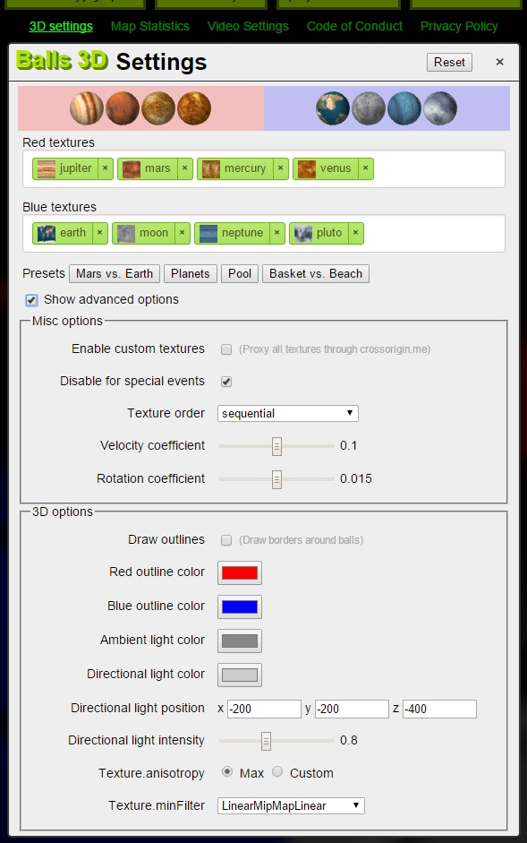
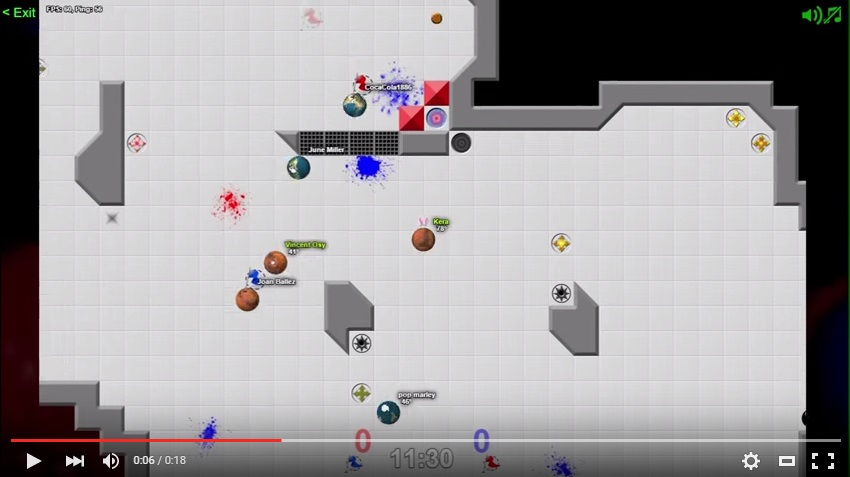
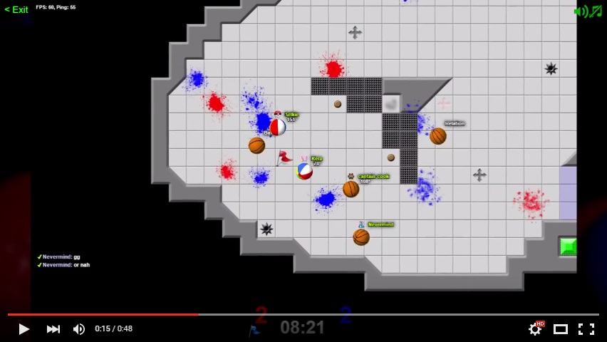

#  TagPro Balls 3D Userscript

**[CLICK HERE TO INSTALL](https://keratagpro.github.io/tagpro-balls-3d/tagpro-balls-3d.user.js)** (requires [Tampermonkey](https://chrome.google.com/webstore/detail/tampermonkey/dhdgffkkebhmkfjojejmpbldmpobfkfo?hl=en))

Replaces ball textures with a live 3D texture using [three.js](http://threejs.org/).

## Installation

1. Install [Tampermonkey](https://chrome.google.com/webstore/detail/tampermonkey/dhdgffkkebhmkfjojejmpbldmpobfkfo?hl=en)
2. Open [tagpro-balls-3d.user.js](https://keratagpro.github.io/tagpro-balls-3d/tagpro-balls-3d.user.js)
3. Enjoy!

**NOTE:** You should disable ball spin userscripts if you have them. 

## Examples

*Options window*

*Mars vs Earth* (video)

*Basket ball vs Beach ball* (video)
 

*Alpha version*

http://gfycat.com/GrandioseDistinctFlyingfox
